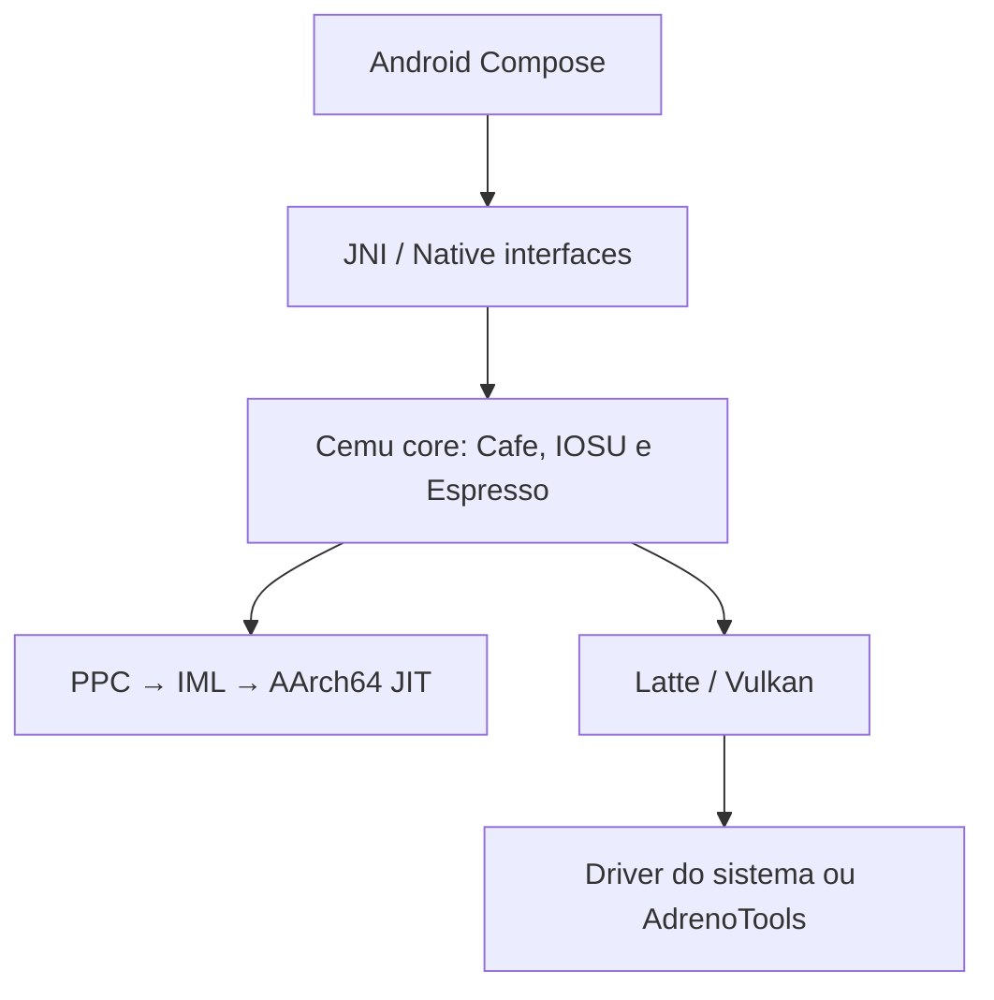

# Arquitetura alvo

## Estado atual

A aplicação segue pacotes por feature. `common` e `nativeinterface` são as
dependências compartilhadas; um teste ArchUnit impede dependências cíclicas entre
features.

## Fronteiras obrigatórias

- `src/Cafe`, `src/Cemu`, `src/Common`, `src/audio`, `src/input`: core comum,
  sincronizado com upstream sempre que possível.
- `src/android`: ciclo de vida, UI, SAF, sensores e integração Android.
- `src/gui/androidgui`: janela/surface nativa Android.
- adaptadores móveis futuros: frame pacing, diagnóstico e seleção de driver;
  nenhuma regra por aparelho deve vazar para a semântica do core.
- upscalers/frame generation: passes explícitos e opcionais do renderer, com
  contrato de entradas e composição do HUD; nunca hacks globais de apresentação.

## Fluxo de configuração

Configuração recomendada em quatro camadas, da menor para a maior precedência:

1. defaults seguros do projeto;
2. perfil por capacidade de GPU/driver;
3. perfil validado por Title ID;
4. escolha explícita do usuário.

Toda camada precisa registrar a origem do valor e permitir restauração. A seleção
de driver deve falhar para o driver do sistema e oferecer modo seguro.

## Contrato para recursos temporais

SGSR 2 e frame generation só avançam quando o renderer fornecer, por frame:

- cor antes do HUD;
- depth válido;
- motion vectors válidos ou reconstrução aprovada;
- jitter e matrizes relevantes;
- histórico com invalidação em mudança de cena/resolução;
- máscara ou composição separada do HUD.

Sem esse contrato, o recurso permanece prova de conceito e desligado.

